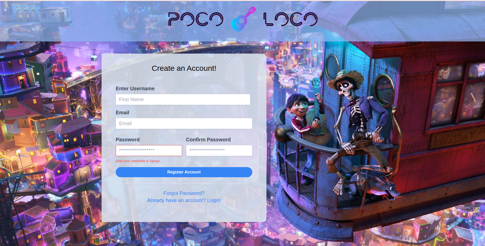
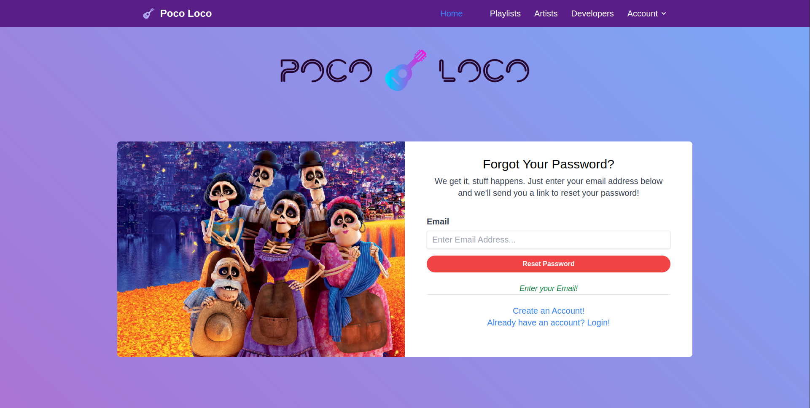
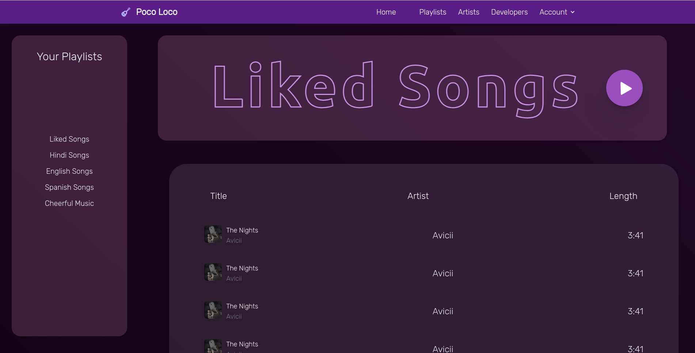
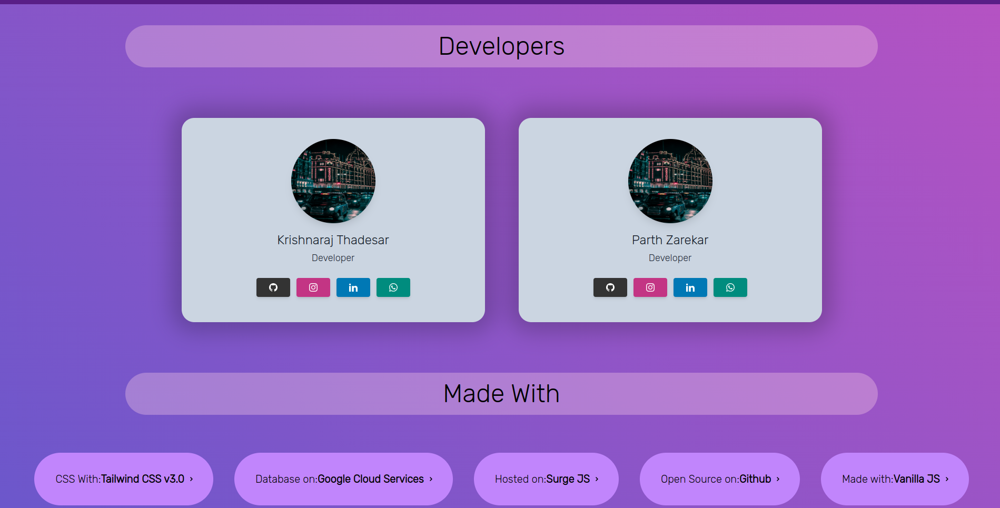
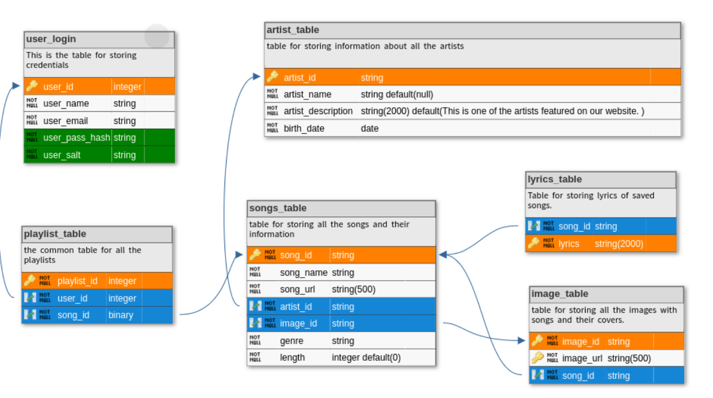

# Visit it [Here!](http://poco-loco.surge.sh)

# Introduction

This was a really fun website to make, and was a really nice learning experience in the world of web dev. This was our first major website, what with front end, backend, server management and all. The goal was to try and create a spotify clone, and we kinda did that somehow I guess.

# Screenshots

## Login Page

## Signup Page

## Password Reset Page

## Home Page

## Artist Page

## Artist Page

## Songs

## Playlist Page

## Developers Page

# Features

1. The basic things like login, and signup, connected with a database.
2. The basic music player features as well, like creating playlists, listening to songs, liking songs, etc.
3. The ability to search for any song, and any artist and play it. Enabled by .
4. The ability to create playlists, and add songs to them.
5. Password Security. Hashes are used to store, and verify passwords, along with salting for individual users, to provide maximum security against password cracking.
6. Artist page, containing description about the artist.
7. Use of various SQL database features like triggers, cursors, queries, subqueries, indexing, etc. to make the website more efficient.

# Requirements and Installation

1. Install NodeJS and npm, then check out the repo for package.json and install all the dependencies using `npm install`.
2. Host a server somehow, or with VS code, open `index.html` and use the live server extension to host the website locally.
3. For Backend, we use ExpressJs to host the server.
4. Install mysql, and create a database, and a user with all privileges on that database.
5. Provide the credentials for the database in the `database_manager.js` file on server side.
6. Tinker to your will!

# Database

The Database is mysql, deployed on [Google Cloud Services](https://cloud.google.com/sql/docs/mysql/quickstart). The database is hosted on a VM instance. It is accessed using the nodejs mysql module.
The Schema Looks like this:

# Todo

1. Deploy servers on cloud (AWS, Heroku, etc.)
2. Add More ways to play songs.
3. Work on improving the playlists.

# Credits

It has been wonderful working on this project, and that was possible only with the help of our Parents, Teachers and ever supporting Friends. We would like to thank them for their support and guidance.

As this project was done as part of Lab Continuous Assesment in Database Management Systems, we would like to thank our DBMS Mams for their guidance and support as well:

Prof. Himangi Pandey &
Prof. Sukhada Bhingarkar

# Contributors

1. [Krishnaraj Thadesar](https://github.com/KrishnarajT)
2. [Parth Zarekar](https://github.com/Parth4123/Parth4123)
